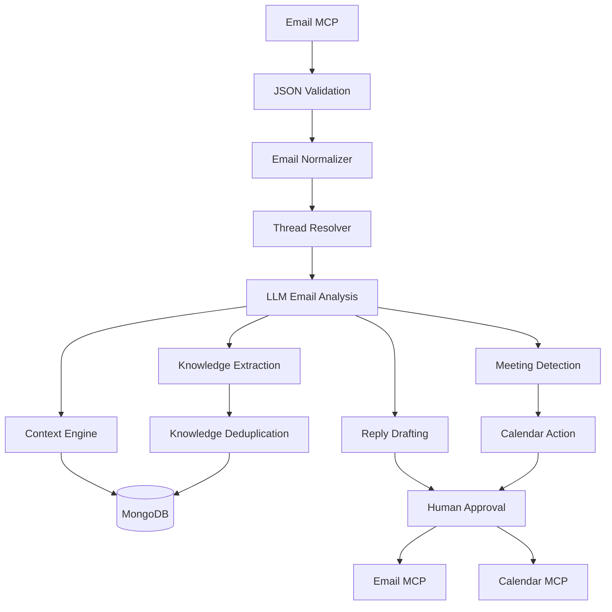
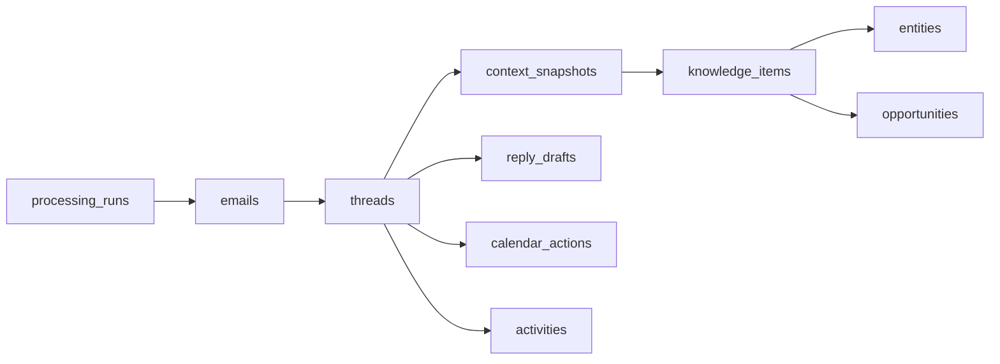

# CoS Sales Agent — Architecture & Data Model (Phase 1)

Status: approved design, pending Phase 2 implementation go-ahead.

## 1. Purpose

A local Chief-of-Staff Sales Sub-Agent that processes the first `EMAIL_LIMIT` (default 50)
emails of a sales mailbox, builds cumulative per-thread context, extracts and deduplicates
sales knowledge, drafts replies, detects meetings, and prepares calendar actions. Internal
reasoning (ingest → analyze → context → knowledge → draft → detect) is fully automatic;
external actions (send email, create calendar event) always require explicit human approval.

Runs entirely locally against MongoDB. Must work with zero personal credentials in demo
mode, and must run unmodified on another developer's Windows/macOS/Linux machine after
cloning and configuring `.env`.

## 2. Tech Stack

| Concern | Choice | Rationale |
|---|---|---|
| Language | Python 3.11+ | |
| Validation | Pydantic v2 | strict schema validation for MCP JSON and LLM output |
| Persistence | MongoDB via `pymongo` (sync) | batch-of-50 scale does not need asyncio |
| UI | Streamlit | fastest path to an inspectable local dashboard |
| LLM | `anthropic` SDK (`ClaudeProvider`) + deterministic `MockLLMProvider` | demo/tests need zero API keys |
| Dedup similarity | `rapidfuzz` token-based similarity | no vector DB / embeddings for v1 |
| Containers | Docker Compose (MongoDB, optional Mongo Express) | |
| Config | `pydantic-settings` reading `.env` | typed, validated env config |
| Tests | `pytest` | |

Explicitly excluded for v1: Kafka, Kubernetes, microservices, vector databases, Celery/Redis
clusters, complex auth systems.

## 3. High-Level Pipeline



A single orchestrator (`app/pipeline.py`) runs each stage per email in order and persists a
`processing_runs` document tracking per-email status. Every stage is a focused
class/function with one responsibility; the orchestrator is the only component aware of
stage order.

Automatic vs. approval-gated, enforced in code (not just documented):

```text
Read email              → automatic
Analyze email           → automatic
Build context            → automatic
Extract knowledge        → automatic
Deduplicate               → automatic
Draft reply               → automatic
Detect meeting            → automatic

Send email                → requires explicit approval
Create calendar event     → requires explicit approval
```

`ReplyDrafter` and `MeetingDetector` only ever *propose*. The only code paths that call
`EmailProvider.send_email()` or `CalendarProvider.create_event()` are the two explicit
approval handlers wired to the Streamlit "Approve" buttons.

## 4. MongoDB Collections

```text
emails                 — one doc per normalized email; message_id unique; carries processing_status
threads                — one doc per conversation; thread_id unique
context_snapshots      — one doc per (thread_id, triggering_email_id); append-only, never overwritten
knowledge_items        — canonical deduplicated knowledge; embeds current_value + history[]
entities               — companies + people, discriminated by `type`; embeds within one collection
opportunities          — one doc per detected sales opportunity per thread
activities             — lightweight audit/event log
reply_drafts           — one doc per draft; source_email_id unique; mutated through its state machine
calendar_actions       — one doc per detected meeting action; (thread_id, meeting_fingerprint) unique
processing_runs        — one doc per pipeline invocation; embeds per-email status list
```

`entities` is a single collection (not split into people/company) with a `type` field —
keeps the "no collection per tiny object" rule while remaining independently indexable.

## 5. Entity Relationships

```text
Email ──belongs_to──> EmailThread
EmailThread ──produces──> ContextSnapshot (versioned, append-only)
ContextSnapshot ──produces──> KnowledgeItem (deduplicated, source-linked)
KnowledgeItem ──relates_to──> Entity (Company | Person) / Opportunity
EmailThread ──produces──> ReplyDraft
EmailThread ──produces──> CalendarAction
EmailThread ──produces──> Activity (audit trail)
ProcessingRun ──tracks──> Email[] (per-run status)
```



## 6. Idempotency (application + database)

| Collection | Idempotency key | Mechanism |
|---|---|---|
| emails | `message_id` unique | duplicate insert is a no-op |
| threads | `thread_id` unique | upsert |
| context_snapshots | **`(thread_id, triggering_email_id)` unique** | engine checks for an existing snapshot for that (thread, email) pair *before* computing a new version; version number is derived only on actual insert — prevents version drift (V4/V5/V6) from reprocessing the same email |
| knowledge_items | `(thread_id, subject_key, predicate, fact_key)` unique | update-in-place: `$addToSet` on `source_emails`, push-on-change for `history` |
| reply_drafts | `source_email_id` unique | re-drafts mutate the same doc through its state machine, never insert a second draft |
| calendar_actions | `(thread_id, meeting_fingerprint)` unique, `fingerprint = normalize(title+start+end)` | re-detecting the same meeting request is a no-op |
| emails.processing_status | n/a (field, not key) | lets the pipeline skip an already-`COMPLETED` email on re-run without touching downstream collections at all |

## 7. Schemas

### 7.1 Normalized Email (`app/email/models.py`)

```json
{
  "message_id": "msg_001",
  "thread_id": "thread_001",
  "from": {"name": "John Smith", "email": "john@example.com"},
  "to": [{"name": "Ashok", "email": "ashok@example.com"}],
  "cc": [],
  "subject": "Enterprise CRM Proposal",
  "body": "We are evaluating your enterprise plan...",
  "timestamp": "2026-09-13T10:30:00Z",
  "in_reply_to": null,
  "references": [],
  "attachments": [],
  "labels": []
}
```

Required: `message_id`, sender, recipients, subject, body, timestamp. Optional (defaulted):
`thread_id`, `cc`, `in_reply_to`, `references`, `attachments`, `labels`. Malformed MCP JSON
is logged, never inserted, and marked as a failed processing attempt for that email only —
the batch continues.

### 7.2 Email Analysis (LLM output, `app/analysis/schemas.py`)

```json
{
  "email_id": "msg_003",
  "summary": "Customer is evaluating enterprise CRM pricing.",
  "intent": "evaluation",
  "entities": [],
  "facts": [{"subject": "Customer", "predicate": "uses", "object": "Salesforce"}],
  "requirements": [],
  "pain_points": ["Pricing"],
  "buying_signals": [],
  "objections": [],
  "competitors": ["Salesforce"],
  "pricing_mentions": [],
  "commitments": [],
  "action_items": [],
  "meetings": [],
  "people": [],
  "companies": [],
  "products": []
}
```

Validated against a Pydantic model. Invalid LLM JSON triggers one structured repair/retry;
on repeated failure the email's processing status is marked `FAILED` at the `ANALYZED`
stage and the batch continues.

### 7.3 Context Snapshot (`context_snapshots`)

```json
{
  "thread_id": "thread_001",
  "context_version": 3,
  "triggering_email_id": "msg_003",
  "context": {
    "summary": "ABC Corp is evaluating our enterprise CRM solution.",
    "participants": [],
    "company": {},
    "opportunity": {},
    "requirements": [
      {"value": "100 seats", "basis": "stated", "source_email_ids": ["msg_001"]}
    ],
    "pain_points": [],
    "products_discussed": [],
    "competitors": [],
    "pricing": {},
    "objections": [],
    "buying_signals": [],
    "decisions": [],
    "commitments": [],
    "open_questions": [],
    "next_actions": [],
    "meetings": []
  },
  "changes_from_previous_context": [
    {"type": "ADDED", "field": "requirements", "detail": "100 seats", "source_email_id": "msg_003"}
  ],
  "created_at": "2026-09-13T10:31:00Z"
}
```

Every list item that originated from an email carries an explicit provenance object:
`{"value": ..., "basis": "stated" | "inferred", "source_email_ids": [...]}`. `basis` is never
collapsed — "inferred" items are always rendered in the UI with a distinct "AI inference"
badge and are never presented as customer-confirmed facts. Diff categories are
`ADDED | REMOVED | UPDATED` (computed `UNCHANGED` entries are not persisted, to keep
documents small).

Cumulative context algorithm:
```text
Previous Context (from context_snapshots, latest version for thread_id)
+ New Email Analysis (LLM call on the new email alone)
= New Context
```
The LLM is never re-given the raw email history — only the previous structured context
plus the new structured analysis — bounding prompt size regardless of thread length.

### 7.4 Knowledge Item (`knowledge_items`)

```json
{
  "knowledge_id": "knowledge_001",
  "thread_id": "thread_001",
  "subject_key": "abc_corp",
  "predicate": "requires",
  "fact_key": "seat_count",
  "current_value": "150 seats",
  "history": [
    {"value": "100 seats", "source_email_id": "msg_001", "recorded_at": "2026-09-13T10:00:00Z"},
    {"value": "150 seats", "source_email_id": "msg_007", "recorded_at": "2026-09-14T09:00:00Z"}
  ],
  "source_emails": ["msg_001", "msg_005", "msg_007"],
  "basis": "stated",
  "first_seen_at": "2026-09-13T10:00:00Z",
  "last_confirmed_at": "2026-09-14T09:00:00Z",
  "confidence": 0.97,
  "status": "active"
}
```

`status` ∈ `active | contradicted | retracted`. A changed value (100→150 seats) is
represented as a value update within one knowledge item — `current_value` changes,
`history` gains an entry, nothing is deleted, `status` stays `active`. `status:contradicted`
is reserved for the rarer case of two claims that are simultaneously current and
irreconcilable (flagged for manual review rather than auto-resolved).

**Canonical identity is built around the fact relationship, not the value:**
`(thread_id, subject_key, predicate, fact_key)`, where `fact_key` is either:
- an **attribute key** (`seat_count`, `budget`, `close_date`, `pricing_tier`,
  `contract_length`, ...) for facts representing one evolving value, resolved via a small
  deterministic keyword/unit lookup table, or
- the **normalized object text** for set-membership facts (competitors mentioned, pain
  points, objections), where each distinct object is legitimately its own item.

This guarantees MongoDB's uniqueness constraint can never block a legitimate value change,
because the value is never part of the unique key.

### 7.5 Deduplication Strategy

```text
Step 1 — Deterministic normalization
  lowercase, strip punctuation/whitespace, normalize numbers ("one hundred" → "100"),
  normalize units via a small curated synonym table (seats/users/licenses → "seats")

Step 2 — Exact/canonical match
  (thread_id, subject_key, predicate, fact_key) exact match → update
  source_emails / last_confirmed_at / confidence on the existing item, no new item

Step 3 — Semantic similarity (rapidfuzz) when Step 2 misses on fact_key resolution
  score ≥ 0.90 on (subject, predicate) + object similarity → same underlying fact;
    if normalized value differs → contradiction/history update (see above)
  score 0.60–0.90 → ambiguous → Step 4
  score < 0.60 → new knowledge item

Step 4 — LLM verification only for the ambiguous band
  targeted prompt: "are these two statements about the same underlying fact?
  A: <existing>, B: <new>" → boolean + reasoning, logged; this is the only
  dedup step that calls the LLM, keeping cost bounded
```

### 7.6 Reply Draft (`reply_drafts`)

```json
{
  "reply_id": "reply_001",
  "thread_id": "thread_001",
  "source_email_id": "msg_004",
  "status": "awaiting_approval",
  "draft": {"subject": "Re: Enterprise pricing", "body": "Hi John..."},
  "created_by": "sales_agent",
  "approved_by": null,
  "sent_at": null
}
```

State machine:
```text
NO_REPLY_REQUIRED
REPLY_DRAFTED → AWAITING_APPROVAL →
  APPROVED → SEND → SIMULATED_SENT | SENT
  EDITED → RE-DRAFTED → AWAITING_APPROVAL
  REJECTED → CANCELLED
```

In demo/simulation mode, approval always ends in `SIMULATED_SENT` with the outgoing
message printed to the UI/log as `[SIMULATED EMAIL SEND]`; no real email is ever sent
unless `SIMULATION_MODE=false` and a real `EmailProvider` is configured.

### 7.7 Calendar Action (`calendar_actions`)

```json
{
  "action": "create_calendar_event",
  "thread_id": "thread_001",
  "meeting_fingerprint": "abc_corp_sales_discussion_2026-09-15t15:00_2026-09-15t16:00",
  "status": "awaiting_approval",
  "event": {
    "title": "ABC Corp Sales Discussion",
    "start": "2026-09-15T15:00:00+05:30",
    "end": "2026-09-15T16:00:00+05:30",
    "timezone": "Asia/Kolkata",
    "description": "Sales discussion based on email thread thread_001",
    "attendees": []
  },
  "actor": {"type": "authenticated_user"}
}
```

State machine: `pending → awaiting_approval → {approved → scheduled | failed, rejected}`;
`needs_clarification` is a separate terminal state for ambiguous requests (e.g. "maybe next
week") until a human resolves it — v1 does not auto re-prompt the customer.

**Attendee security (enforced in code, not just by convention):**

```python
class CalendarEvent(BaseModel):
    ...
    attendees: list[str] = Field(default_factory=list)

    @field_validator("attendees")
    @classmethod
    def validate_no_external_attendees(cls, value: list[str]) -> list[str]:
        if value:
            raise ValueError("External attendees are not permitted")
        return value
```

This is checked twice: once at model construction (validator above), and again
immediately before `CalendarProvider.create_event()` is called (`assert
action.event.attendees == []`, since a dict loaded back from MongoDB bypasses the
constructor). Any external attendee — sender, customer, CC, or otherwise — causes the
calendar action to fail closed with `status=failed, reason="external attendees not
permitted"`; it is never silently stripped and never reaches the calendar provider.

## 8. Thread Detection (`app/email/threading.py`, deterministic, no LLM)

1. Provider `thread_id` if supplied → use directly.
2. Else match `in_reply_to` against known `message_id`s → inherit that thread.
3. Else match any id in `references` against known `message_id`s → inherit.
4. Else normalize subject (strip `Re:`/`Fwd:`, case-fold, collapse whitespace) and match
   against an existing thread's normalized subject **and** require sender/recipient overlap.
5. Else fallback: same participant set within a configurable time window (default 14 days)
   → attach to the most recent matching thread.
6. Else → new thread.

## 9. Meeting Detection

Extracts `{meeting_detected, title, start, end, timezone, description}` from clear requests
("Let's meet Tuesday at 3 PM for 30 minutes"). Ambiguous requests ("Maybe next week") never
auto-create a calendar action — they return `meeting_action = needs_clarification` with the
missing information identified.

## 10. Provider / Portability Model

Interfaces in `app/interfaces/`: `EmailProvider`, `CalendarProvider`, `LLMProvider`, plus a
`Repository` protocol per collection. `ProviderFactory` reads `EMAIL_PROVIDER` /
`CALENDAR_PROVIDER` / `LLM_PROVIDER` from settings and returns the concrete implementation;
nothing outside `app/providers/` imports a concrete provider class.

```text
EmailProvider    ├── MCPEmailProvider ├── MockEmailProvider ├── DemoEmailProvider
CalendarProvider ├── MCPCalendarProvider ├── MockCalendarProvider
LLMProvider      ├── ClaudeProvider ├── OpenAIProvider ├── MockLLMProvider
```

`MCPEmailProvider`/`MCPCalendarProvider` wrap the official `mcp` Python SDK client and
translate whatever the connected MCP server returns into the normalized Pydantic models.
If `MCP_EMAIL_ENABLED=false`, `ProviderFactory` never imports the MCP client module, so an
unavailable/unconfigured MCP server cannot break demo/mock runs.

Portability rules (hard acceptance criteria): no hardcoded Windows usernames, absolute
paths, personal email addresses, API keys, MongoDB credentials, or calendar IDs anywhere in
source. All environment-specific values come from `.env`. Required repo files:
`.env.example`, `.gitignore`, `docker-compose.yml`, `Dockerfile`, `requirements.txt`,
`README.md` (with separate Windows and macOS/Linux setup instructions).

## 11. Demo Mode

```bash
python main.py --mode=demo
```
with
```env
EMAIL_PROVIDER=demo
CALENDAR_PROVIDER=mock
LLM_PROVIDER=mock
SIMULATION_MODE=true
DEMO_SEED=42
```
requires no personal credentials, and demonstrates the full pipeline end to end: ingestion →
threading → analysis → cumulative context → context diff → knowledge extraction →
deduplication → contradiction/history → reply drafting → approval → simulated send →
meeting detection → calendar approval → simulated calendar creation. `DEMO_SEED` makes the
synthetic dataset reproducible across machines.

## 12. Clean First-Run Experience

```text
git clone/copy → create .env from .env.example → docker compose up -d →
pip install -r requirements.txt → python main.py --healthcheck → python main.py --mode=demo
```

`main.py` calls `initialize_database()` / `initialize_indexes()` unconditionally on every
startup (both `--healthcheck` and `--mode=demo`) — collection/index creation is never a
manual step, and running the app multiple times is always safe.

## 13. Project Structure

As originally specified (section 34 of the request), with two additions:
`app/pipeline.py` as the orchestrator wiring the stages together (keeping `main.py` a thin
CLI entrypoint), and `app/config/logging.py` for structured logger setup.

## 14. Explicit Design Decisions (flagged, not unilateral)

1. `rapidfuzz` token similarity instead of embeddings/vector DB for semantic dedup.
2. `entities` is one collection with a `type` discriminator instead of separate
   people/company collections.
3. Knowledge identity is thread-scoped (`thread_id` included in the unique key) —
   cross-thread entity resolution is out of scope for v1.
4. `fact_key` classification (attribute vs. set-membership) uses a small deterministic
   keyword/unit lookup table, not NLP/ML.
