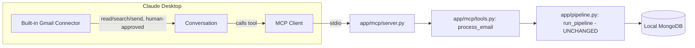

# CoS Sales Agent — Local MCP Server for Claude Desktop's Gmail Connector (Phase 3)

Status: approved design, pending implementation plan.

## 1. Purpose

Expose the existing sales-agent pipeline (email analysis, cumulative context, knowledge
extraction/deduplication, meeting detection, reply drafting) as a local MCP tool that Claude
Desktop can call directly. Claude Desktop's **built-in Gmail connector** — not this
project — is the only thing that ever reads, searches, drafts, replies to, or sends Gmail
messages, under Claude's normal per-action approval controls. This project never talks to
Gmail, the Gmail API, or any OAuth flow.

The result: in a Claude Desktop conversation, Claude reads a Gmail message via its Gmail
connector, hands the message content to this project's `process_email` MCP tool, gets back
structured analysis/knowledge/a draft reply/a meeting proposal, and then (if the user
approves) uses its Gmail connector's own send/reply tool to act — exactly the same
human-approval model the existing Streamlit dashboard uses for direct pipeline runs, just
routed through Claude's approval UI instead.

## 2. Non-Goals (explicit exclusions)

- No Gmail API client, no Google OAuth credentials, no `google-api-python-client`.
- No change to `EMAIL_PROVIDER`, `ProviderFactory.create_email_provider`, or the existing
  `MCPEmailProvider`/`MCPCalendarProvider` stubs — they remain untouched and unused by this
  feature.
- No change to `app/pipeline.py`, `app/config/settings.py`, `app/providers/factory.py`, or
  any existing repository/domain module.
- No calendar event creation from the new tool — meeting detection output is informational
  only; scheduling still only ever happens through the existing Streamlit "Create on my
  calendar" approval flow, unmodified.
- No Docker/WSL — the MCP server is a plain local Python process Claude Desktop launches
  directly, talking to the MongoDB instance the user already runs locally.

## 3. Tech Stack Addition

| Concern | Choice | Rationale |
|---|---|---|
| MCP server framework | `mcp` (official Python SDK) — `mcp.server.fastmcp.FastMCP` | Standard library for building a local MCP server Claude Desktop can launch over stdio; decorator-based tool registration generates the JSON schema from type hints automatically. |
| Transport | stdio | The standard transport for a Claude-Desktop-launched local server (`command` + `args` in `claude_desktop_config.json`); no network port, no auth to manage. |
| Tool LLM provider | `ClaudeProvider` (existing, `app/providers/llm/claude.py`) via `LLM_PROVIDER=claude` | User has an Anthropic API key; reuses the existing, already-implemented provider without new code. |
| Tool calendar provider | `MockCalendarProvider` (existing) | No real calendar integration is in scope; meeting detection output stays informational. |

`requirements.txt` gains one new line: `mcp`.

## 4. Architecture



Two new files carry all new logic; nothing existing changes:

```text
app/mcp/__init__.py
app/mcp/tools.py   — pure business logic, no MCP SDK import, fully unit-testable
app/mcp/server.py  — FastMCP wiring + stdio entrypoint (python -m app.mcp.server)
```

### Why no changes to `pipeline.py`

`run_pipeline(db, email_provider, llm_provider, calendar_provider, settings)` already accepts
any `EmailProvider`. The existing `MockEmailProvider(payloads: list[dict])` (in
`app/providers/email/mock.py`) already does precisely "hand the pipeline a fixed list of raw
email dicts" — which is exactly what a single Gmail message arriving as a tool call needs.
Wrapping the one email in `MockEmailProvider(payloads=[raw_email])` and calling the existing,
already-tested `run_pipeline` reuses 100% of the pipeline's validation, threading, analysis,
context, knowledge, reply-drafting, and meeting-detection logic with zero risk to existing
behavior or tests.

## 5. Tool Contract

One tool, `process_email`, parameterized with the **existing** `app.email.models.Email`
Pydantic model directly (not a new duplicate schema) — FastMCP derives the JSON schema
(including the `"from"` alias) from it automatically.

```python
@mcp.tool()
def process_email(email: Email) -> dict:
    """Run one Gmail message through the sales-agent pipeline: normalization, thread
    resolution, LLM analysis, cumulative context, knowledge extraction/deduplication,
    meeting detection, and reply drafting. Persists everything to MongoDB. Returns
    structured results — including a proposed reply draft and/or meeting proposal for you
    to review and act on via your Gmail connector. Never sends email or creates calendar
    events itself.

    Map Gmail fields into the input shape as follows:
    - message_id: Gmail message id (or Message-ID header)
    - thread_id: Gmail thread id, if available (omit if unknown — the pipeline will infer one)
    - from/to/cc: {"name": ..., "email": ...} objects
    - timestamp: ISO-8601 datetime string
    - in_reply_to / references: Message-ID header values, if available
    """
```

Tool description text above is the authoritative mapping guidance Claude uses; it ships
verbatim as the tool's docstring so it is visible to Claude Desktop at call time.

### Input validation

Handled entirely by `Email.model_validate` (existing, unchanged) — a malformed tool call
argument surfaces as a standard MCP tool error back to Claude, with no new validation code
required.

### Output shape

```json
{
  "status": "completed" | "skipped" | "failed",
  "error": "string or null — populated only when status is failed",
  "thread_id": "string or null",
  "context_summary": "string or null — ThreadContext.summary after this email",
  "knowledge": [
    {"subject_key": "...", "predicate": "...", "current_value": "...", "basis": "stated|inferred", "confidence": 0.0}
  ],
  "reply_draft": {"subject": "...", "body": "..."} ,
  "calendar_proposal": {
    "status": "awaiting_approval | needs_clarification",
    "title": "...", "start": "...", "end": "...", "timezone": "...", "reason": "..."
  }
}
```

`reply_draft` and `calendar_proposal` are `null` when the pipeline produced none (e.g. no
reply needed, or no meeting language detected). `calendar_proposal` never includes a
`scheduled` action — the tool only ever surfaces `awaiting_approval` /
`needs_clarification` proposals that already exist in `calendar_actions`, for Claude to
relay to the user; it never calls `CalendarProvider.create_event()`.

## 6. `app/mcp/tools.py` — `process_email(db, email, llm_provider, calendar_provider, settings) -> dict`

```text
1. raw = email.model_dump(mode="json", by_alias=True)
2. provider = MockEmailProvider(payloads=[raw])
3. summary = run_pipeline(db, provider, llm_provider, calendar_provider, settings)
4. result = summary.results[0]  (list has exactly one entry — one email in, one result out)
5. if result.final_stage == "FAILED":
     return {"status": "failed", "error": result.error, "thread_id": None,
             "context_summary": None, "knowledge": [], "reply_draft": None,
             "calendar_proposal": None}
6. else (COMPLETED or SKIPPED — SKIPPED means this message_id was already processed to
   completion by an earlier call; its data is already in MongoDB from that run):
     snapshot = ContextSnapshotRepository(db).find_one({"triggering_email_id": email.message_id})
     thread_id = snapshot["thread_id"] if snapshot else None
     knowledge = KnowledgeRepository(db).all_for_thread(thread_id) if thread_id else []
     draft = ReplyDraftRepository(db).find_one({"source_email_id": email.message_id})
     calendar_actions = CalendarActionRepository(db).find_many({"thread_id": thread_id}) if thread_id else []
     pending_calendar = next(
         (a for a in calendar_actions if a["status"] in ("awaiting_approval", "needs_clarification")),
         None,
     )
     return {
         "status": result.final_stage.lower(),
         "error": None,
         "thread_id": thread_id,
         "context_summary": snapshot["context"]["summary"] if snapshot else None,
         "knowledge": [
             {"subject_key": k["subject_key"], "predicate": k["predicate"],
              "current_value": k["current_value"], "basis": k["basis"],
              "confidence": k["confidence"]}
             for k in knowledge
         ],
         "reply_draft": draft["draft"] if draft else None,
         "calendar_proposal": (
             {
                 "status": pending_calendar["status"],
                 "title": pending_calendar["event"]["title"],
                 "start": pending_calendar["event"]["start"],
                 "end": pending_calendar["event"]["end"],
                 "timezone": pending_calendar["event"]["timezone"],
                 "reason": pending_calendar.get("reason"),
             }
             if pending_calendar else None
         ),
     }
```

No new error handling is introduced: `run_pipeline` already wraps every stage in a broad
`except Exception` per email and always returns a well-formed `PipelineRunSummary`, so
`process_email` never needs to catch anything itself.

## 7. `app/mcp/server.py`

```text
settings = get_settings()                                    # existing, unchanged
db = initialize_database(get_client(settings.mongodb_uri),
                          settings.mongodb_database)          # existing, unchanged
llm_provider = ProviderFactory.create_llm_provider(settings)       # -> ClaudeProvider
calendar_provider = ProviderFactory.create_calendar_provider(settings)  # -> MockCalendarProvider

mcp = FastMCP("cos-sales-agent")

@mcp.tool()
def process_email(email: Email) -> dict:
    return tools.process_email(db, email, llm_provider, calendar_provider, settings)

if __name__ == "__main__":
    mcp.run()  # stdio transport
```

`db`, `llm_provider`, and `calendar_provider` are constructed once at process startup (the
server is a long-lived process Claude Desktop keeps running, not spawned per call), matching
how the Streamlit dashboard already caches its DB handle via `@st.cache_resource`.

## 8. Configuration

`.env` gains no new keys — it reuses existing `Settings` fields:

```env
MONGODB_URI=mongodb://localhost:27017     # already the default; user's local MongoDB
LLM_PROVIDER=claude
LLM_API_KEY=<the user's Anthropic API key>
LLM_MODEL=claude-sonnet-5                 # or whichever model the user has access to
```

`EMAIL_PROVIDER` and `CALENDAR_PROVIDER` settings are read by `ProviderFactory` but the MCP
path only calls `create_llm_provider` and `create_calendar_provider` — `EMAIL_PROVIDER` is
never consulted by this feature, consistent with never invoking `MCPEmailProvider`.

## 9. Claude Desktop Integration

Added to Claude Desktop's `claude_desktop_config.json` under `mcpServers`:

```json
{
  "mcpServers": {
    "cos-sales-agent": {
      "command": "<path to .venv>\\Scripts\\python.exe",
      "args": ["-m", "app.mcp.server"],
      "cwd": "C:\\Users\\User.ODL00510\\Desktop\\cos-sales-agent\\.claude\\worktrees\\phase-2-implementation"
    }
  }
}
```

Claude Desktop launches this as a subprocess over stdio on startup; no separate "run the
server" step is needed once configured. Exact command/config JSON is finalized and verified
in the implementation plan.

## 10. Testing

`tests/test_mcp_tools.py` tests `app/mcp/tools.py` directly (no MCP SDK involved), using
`mongomock` + `MockLLMProvider` + `MockCalendarProvider` — identical pattern to every
existing test in the suite:

1. A normal email with a buying signal → `status == "completed"`, non-null `reply_draft`,
   non-empty `knowledge`, `calendar_proposal is None`.
2. Re-submitting the same `message_id` a second time → `status == "skipped"`, same
   `thread_id` and `knowledge` as the first call (idempotency preserved).
3. An email containing clear meeting language ("Let's meet Tuesday at 3 PM for 30 minutes")
   → non-null `calendar_proposal` with `status == "awaiting_approval"`, and no call ever
   reaches `CalendarProvider.create_event()` (assert on `MockCalendarProvider().created_events`
   staying empty).
4. A `FAILED` case (e.g. malformed analysis from a broken LLM stub) → `status == "failed"`,
   `error` populated, all other fields empty/`None`.

`app/mcp/server.py` is intentionally left without an automated test (a few lines of
constructor wiring plus `mcp.run()`); it is verified manually via `mcp dev
app/mcp/server.py` (the SDK's stdio inspector) as part of the implementation plan's manual
verification step, consistent with how `app/ui/dashboard.py` also has no automated test today.

## 11. Explicit Design Decisions (flagged, not unilateral)

1. Single tool (`process_email`) rather than a richer read/query tool set — chosen for the
   smallest reviewable surface; the tool's return payload already contains everything Claude
   needs for one turn (context summary, knowledge, draft, meeting proposal) without a
   separate round-trip.
2. `MockEmailProvider` reused as a one-shot single-email adapter rather than refactoring
   `pipeline.py` to add a `process_single_email` function — avoids touching already-tested
   orchestration code entirely.
3. Real `ClaudeProvider` (Anthropic API) selected for LLM reasoning per user's own API key,
   rather than the deterministic `MockLLMProvider` — trades zero-cost/zero-credential demo
   behavior for higher-quality analysis, which is the user's explicit choice for this
   feature only; `LLM_PROVIDER=mock` remains the default for `python main.py --mode=demo`
   and all existing tests.
4. Calendar output is read-only/informational — no `CalendarProvider.create_event()` call is
   ever reachable from the new code path, matching the user's explicit Gmail-only scope.
